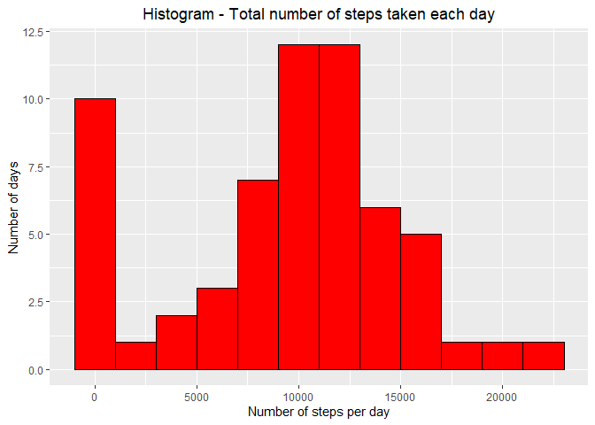
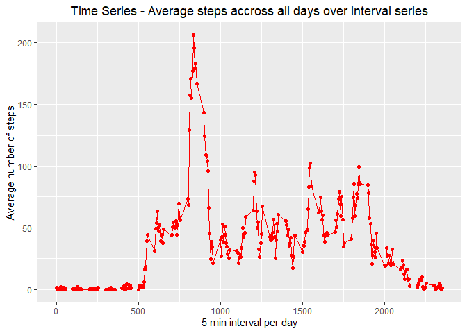
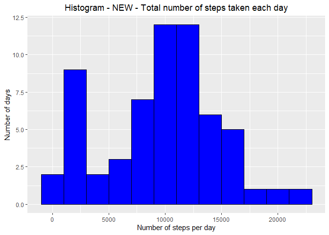
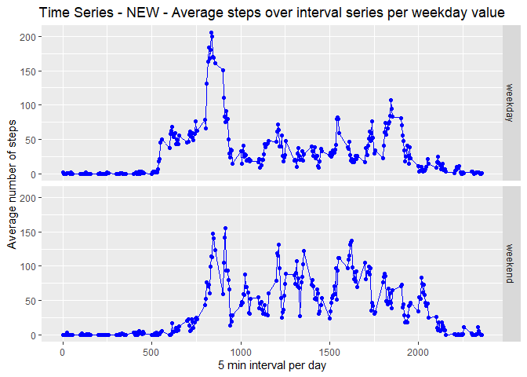

This R Markdown document describes each of the steps required to complete the Reproducible Research JHU-Coursera, Course Project 1.


## Loading and preprocessing the data

The following code:

0. Validates if source data file has been unzipped. In case it hasn't, it unzips it.


```r
zippedfilename <- 'activity.zip'
unzippedfilename <- 'activity.csv'
if (!file.exists(unzippedfilename)) {
        unzip(zippedfilename)
}
```

1. Loads the data into R.


```r
activity <- read.csv(unzippedfilename, header = TRUE, na.strings = c('NA'))
```

2. Processes data set for further analyses.


```r
activity <- tibble::as_tibble(activity)
activity$date <- ymd(activity$date)
```


## What is mean total number of steps taken per day?


In this section of the document, the code will perform the following steps:

1. Calculates the total number of steps, while ignoring missing values.


```r
total_steps_day <- activity %>% select(-c(interval)) %>%
        group_by(date) %>% summarise_all(sum, na.rm = TRUE)
```

2. Creates a histogram of the total number of steps per day.


```r
print({
        g <- ggplot(total_steps_day, aes(x = steps))
        g + geom_histogram(binwidth = 2000, fill = 'red', color= 'black') +
                ggtitle("Histogram - Total number of steps taken each day") +
                theme(plot.title = element_text(hjust = 0.5)) +
                xlab('Number of steps per day') +
                ylab('Number of days')
})
```

<!-- -->

3. Calculates and reports the mean and median of the total number of steps per day.


```r
summary_total_steps_day <- summary(total_steps_day$steps)
print(summary_total_steps_day[c('Mean', 'Median')])
```

```
##     Mean   Median 
##  9354.23 10395.00
```


## What is the average daily activity pattern?


In this section of the document, the code will perform the following steps:

1. Creates a time series of the average number of steps across all days.


```r
total_steps_interval <- activity %>% select(-c(date)) %>%
        group_by(interval) %>% summarise_all(mean, na.rm = TRUE)
print({
        g <- ggplot(total_steps_interval, aes(interval, steps))
        g + geom_point(color = 'red') + geom_line(color = 'red') +
                ggtitle("Time Series - Average steps accross all days over interval series") +
                theme(plot.title = element_text(hjust = 0.5)) +
                xlab('5 min interval per day') +
                ylab('Average number of steps')
})
```

<!-- -->

2. Determines which 5-min interval, on average across all days, contains the maximum number of steps.


```r
max_interval <- total_steps_interval[total_steps_interval$steps == max(total_steps_interval$steps), ]
print(max_interval)
```

```
## # A tibble: 1 x 2
##   interval steps
##      <int> <dbl>
## 1      835  206.
```


## Imputing missing values
  

In this section of the document, the code will perform the following steps:

1. Calculates the total number of rows with missing values in the data set.


```r
missing_values <- activity[is.na(activity$steps) | is.na(activity$date) | is.na(activity$interval), ]
dim(missing_values)[1]
```

```
## [1] 2304
```

2. Designs a strategy to replace missing values (the minimum value between the day mean, day median, interval mean, and interval median).


```r
## Calculating reference values
mean_values_day <- activity %>% select(-c(interval)) %>%
        group_by(date) %>% summarise_all(mean, na.rm = TRUE)
median_values_day <- activity %>% select(-c(interval)) %>%
        group_by(date) %>% summarise_all(median, na.rm = TRUE)
mean_values_interval <- activity %>% select(-c(date)) %>%
        group_by(interval) %>% summarise_all(mean, na.rm = TRUE)
median_values_interval <- activity %>% select(-c(date)) %>%
        group_by(interval) %>% summarise_all(median, na.rm = TRUE)
```

3. Creates a new data set replacing missing values from the original.


```r
## Replacing values
new_activity <- activity
for (i in 1:nrow(activity)) {
        if (is.na(activity$steps[i])) {
                mean_day <- mean_values_day[mean_values_day$date == activity$date[i], 2]
                median_day <- median_values_day[median_values_day$date == activity$date[i], 2]
                mean_int <- mean_values_interval[mean_values_interval$interval == activity$interval[i], 2]
                median_int <- median_values_interval[median_values_interval$interval == activity$interval[i], 2]
                min_val <- min(mean_day, median_day, mean_int, median_int, na.rm = TRUE)
                max_val <- max(mean_day, median_day, mean_int, median_int, na.rm = TRUE)
                new_activity$steps[i] <- min_val
        } else {
                new_activity$steps[i] <- activity$steps[i]
        }
}
```

4. Creates a histogram of the total number of steps, and calculates mean and median.


```r
new_total_steps_day <- new_activity %>% select(-c(interval)) %>%
        group_by(date) %>% summarise_all(sum, na.rm = TRUE)
print({
        g <- ggplot(new_total_steps_day, aes(x = steps))
        g + geom_histogram(binwidth = 2000, fill = 'blue', color= 'black') +
                ggtitle("Histogram - NEW - Total number of steps taken each day") +
                theme(plot.title = element_text(hjust = 0.5)) +
                xlab('Number of steps per day') +
                ylab('Number of days')
})
```

<!-- -->

```r
new_summary_total_steps_day <- summary(new_total_steps_day$steps)
print(new_summary_total_steps_day[c('Mean', 'Median')])
```

```
##      Mean    Median 
##  9503.869 10395.000
```

NOTE: It is important to mention that the histogram changes only slightly, particularly on the first and second 2000 step buckets. Also, the mean value was barely increased, while the median remained the same.


## Are there differences in activity patterns between weekdays and weekends?


In this section of the document, the code will perform the following steps:

1. Creates new weekday factor variable using weekdays function.


```r
new_activity <- new_activity  %>% mutate(weekday = weekdays(date))
new_activity$weekday[new_activity$weekday == 'Sunday'] <- 'weekend'
new_activity$weekday[new_activity$weekday == 'Saturday'] <- 'weekend'
new_activity$weekday[new_activity$weekday != 'weekend'] <- 'weekday'
new_activity <- new_activity  %>% mutate(weekday = as.factor(weekday))
str(new_activity)
```

```
## tibble [17,568 x 4] (S3: tbl_df/tbl/data.frame)
##  $ steps   : num [1:17568] 0 0 0 0 0 0 0 0 0 0 ...
##  $ date    : Date[1:17568], format: "2012-10-01" "2012-10-01" ...
##  $ interval: int [1:17568] 0 5 10 15 20 25 30 35 40 45 ...
##  $ weekday : Factor w/ 2 levels "weekday","weekend": 1 1 1 1 1 1 1 1 1 1 ...
```

2. Creates a time series of the 5 min interval and average number of steps per weekday factor variable value.


```r
new_total_steps_interval <- new_activity %>% select(-c(date)) %>%
        group_by(interval, weekday) %>% summarise_all(mean, na.rm = TRUE)
print({
        g <- ggplot(new_total_steps_interval, aes(interval, steps))
        g + geom_point(color = 'blue') + geom_line(color = 'blue') +
                facet_grid(weekday~., ) +
                ggtitle("Time Series - NEW - Average steps over interval series per weekday value") +
                theme(plot.title = element_text(hjust = 0.5)) +
                xlab('5 min interval per day') +
                ylab('Average number of steps')
})
```

<!-- -->
